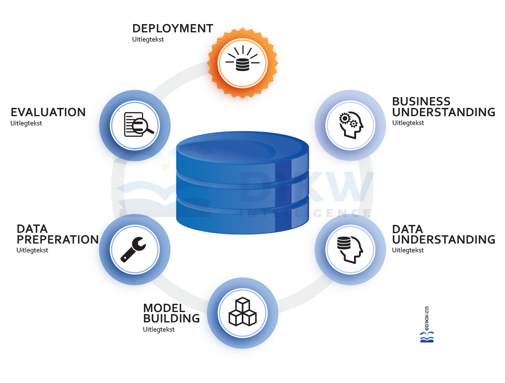

```{r setup, include=FALSE}
knitr::opts_chunk$set(echo = TRUE, warnings = FALSE, message = FALSE, cache = FALSE)

setwd("~/r-studio/aedes-mutaties")
```

## Introductie

Dit is een template voor het uitvoeren van data analyses op mutatie data. Het uitgangspunt is dat we R & RStudio gebruiken voor deze analyses.

De analyse is opgedeeld in een aantal stappen:

* 01 data analyse
* 02 model ontwikkeling
* 03 evaluatie
* 04 business case

Voor ieder van de stappen is een template beschikbaar.

## CRISP-DM
We gebruiken de Crisp-DM methodologie voor het doen van datascience analyses. De methodologie is al decenia oud maar nog steeds veel gebruikt. Sluit perfect aan bij moderne agile projectmanagement technieken.

{#id .class width=500 height=350px}

## Data Mutaties laden

Data laden, de werkgoep heeft gebruik kunnen maken van gegevens beschikbaar gesteld door Steadon. De volledige data wordt **niet** gedeeld in deze repository.

Voor deze analyse hebben we twee datasets beschikbaar, de trainingsset, dit is data van 2013 t/m 2017 en de testset data uit 2018.

```{r}
setwd("~/git/Datascience4AEDES/thema/mutatiegraad")
require(farff)
# training data 2013 t/m 2016
df.13141516 = readARFF("./data/verhuurmutaties_mutaties_train_13141516.arff")
df.trn <- df.13141516
# test data 2018
df.18 = readARFF("./data/verhuurmutaties_mutaties_test_2018.arff")
df.tst <- df.18
```

## Uitkomst definitie

De exacte uitkomst definitie blijft lastig en is ook sterk afhankelijk van de uiteindelijke toepassing.

De defenitie luidt : "Heeft er het jaar volgend op het registratie jaar een mutatie plaatsgevonde op dit adre?"

```{r}
# trainings data 2013 tm 2016
table(df.trn$oge_mutatie_label)
```

```{r}
# test data 2018
table(df.tst$oge_mutatie_label)
```

## Kruis tabellen

```{r}
table(df.trn$oge_oge_type,df.trn$svh_type_woningzoeker_reacties)
```

## Data Preparatie

Voor een analyse is het on ontbeerlijk dat we een aantal filters en toetsen toepassen op de ruwe data.


```{r}
# voor een reproduceerbaar resulltaat zetten we de randomizer vast
set.seed(123)
# leeftijd -1 eruit (onbekend?)
df <- df.trn[df.trn$hrdr_leeftijd_contractant>0,]
# KANG en ZW eruit voor nu te weinig datapunten
df <- droplevels(subset(df, oge_oge_type %in% c("AP", "EW", "MA"))) 
```

## Test set ook filteren
```{r}
# leeftijd -1 eruit (onbekend?)
df.tst <- df.tst[df.trn$hrdr_leeftijd_contractant>0,]
# KANG en ZW eruit voor nu te weinig datapunten, en drop levels
df.tst <- droplevels(subset(df.tst, oge_oge_type %in% c("AP", "EW", "MA"))) 
# remove levels in factors
df.tst <- droplevels(subset(df.tst, hrdr_samenstelling %in% c("1", "2", "3"))) 
```

## Downsamplen

We zien een zeer scheve verdeling van het uitkomst vlaggetje, door de oververtegenwoordigde klasse te downsampelen kunnen we zonder vel verlies van kwaliteit een kleinere dataset maken.

```{r}
# downsample "geen mutatie"
# alle mutaties
df.mut <- subset(df, oge_mutatie_label %in% c("mutatie"))
df.gm <- subset(df, oge_mutatie_label %in% c("geen mutatie"))
# 10 pct sample
df.gm.10pct <- df.gm[sample(nrow(df.gm),round(nrow(df.gm)/10)),]
# aan elkaar plakken
df <- rbind(df.mut,df.gm.10pct)
table(df$oge_mutatie_label)
```


## Visualisatie voorbeelden
Visualeinspectie van de dataset geeft een eerste beeld van de data. We kunnen een aantal variabelen uitzetten tegen het uitkomst label.

```{r, fig.height=3}
require(ggplot2, quietly = TRUE)
# basic histogram
p <- ggplot(df, aes(hrdr_leeftijd_contractant, fill = oge_mutatie_label)) +
  ggtitle('Histogram Leeftijd') +
  geom_histogram(bins = 100)
p
```


## Aantal maanden gewoond

```{r, fig.height=3}
require(ggplot2, quietly = TRUE)
# basic histogram
q <- ggplot(df, aes(oge_aantal_maanden_gewoond, fill = oge_mutatie_label)) + 
    ggtitle('Histogram Aantal maanden gewoond') +
  geom_histogram(bins = 250)
q
```

## huur_subsidiabele_huur_incl_btw
Voor financiele variabelen is het gebruikelijk deze op een log schaal weer te geven, hier gebruiken we `r log10(1000)` betekend dus $10^3= 1000$.

```{r, fig.height=3}
# log schaal 
q <- ggplot(df, aes(huur_subsidiabele_huur_incl_btw, fill = oge_mutatie_label)) + 
  ggtitle('Histogram Subidiale huur (incl BTW)') +
  geom_histogram(bins = 250) 
#  scale_x_log10(
#     breaks = scales::trans_breaks("log10", function(x) 10^x),
#    labels = scales::trans_format("log10", scales::math_format(10^.x))
#  ) 
q
```


## Meer geavanceerde plots
Ggplot is een zeer uitgebreide bibliotheek voor statische plots.
Met ggplot kunnen we net als met een kruistabel verschillende plots per groep maken met behulp van facets.
```{r}
library(ggplot2)
# maak het plot object aan maar maak nog geen plot
p <- ggplot(data = df[sample(nrow(df),5000),], 
            aes(y=hrdr_leeftijd_contractant,
                x=huur_subsidiabele_huur_incl_btw,
                col=oge_mutatie_label)) + 
            scale_x_log10() + ylim(18,100) + xlim(300,1000) +
            geom_point(alpha = 0.1 ) +
            geom_smooth(method=loess)
```

## Facet plot
```{r, fig.height=4, warning=FALSE}
# plot het resultaat in een kruis tabel 
# oge_oge_type x svh_type_woningzoeker_reacties 
p + facet_wrap(svh_type_woningzoeker_reacties ~ oge_oge_type)
```

## Dataset exporteren als csv file
Voor verder gebruik in de volgende templates exporeren wee dataset naar csv formaat.
```{r}
write.csv(df, "./data/mutaties13141516.csv")
write.csv(df.tst, "./data/mutaties18.csv")
```

## Resultaat

In deze stap hebben we de data ingelezen vanuit het arff formaat (Weka). 

We hebben de data opgesplits in een trainings deel en een test deel. 

We hebben een aantal filters toegepast, en de data gesampled zodat de uitkomst labels niet zo scheef verdeeld zijn.

Daarna hebben we een aantal plots gemaakt voor een eerste visuele tour door de data.